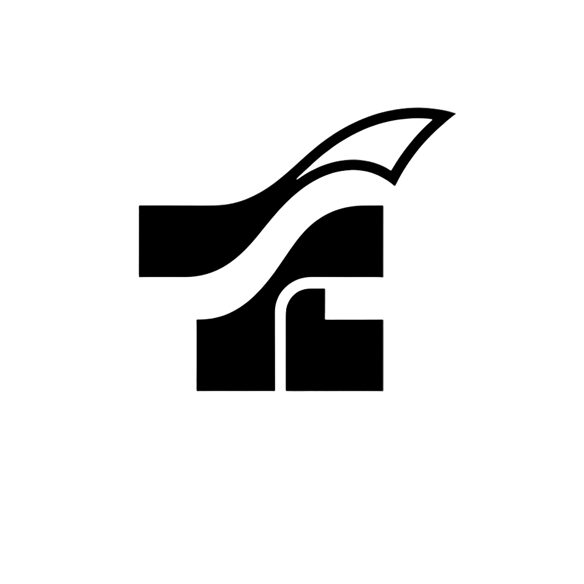

<div align="center">
  
  <h1>🚀 TARIK: Gamified Lossless Yield Wars</h1>
  <p><strong>Satu Codebase. Tiga Chain. Tiga Kemenangan.</strong></p>
</div>

---

## 📖 Elevator Pitch

**TARIK** adalah platform DeFi inovatif berbasis gamifikasi di mana pengguna dapat mempertaruhkan native koin (MON) mereka ke salah satu dari dua kubu yang sedang "bertanding" (Misal: Bull vs Bear, $DEGEN vs $HIGHER). 

**Aturan Emas TARIK:**
- 🛡️ **Modal (Principal) 100% AMAN** dan bisa ditarik kembali kapan saja setelah ronde selesai.
- 📈 Semua dana yang di-stake akan mensimulasikan penghasilan *yield* (seperti Aave/Compound).
- 🏆 **Kubu Pemenang** mendapatkan kembali modal utuh mereka **+ SELURUH YIELD** dari kedua kubu.
- 💀 **Kubu Kalah** mendapatkan kembali modal utuh mereka (0% yield).

*Tidak ada risiko kehilangan modal. Hanya keseruan murni dan hasil (yield) nyata.*

---

## ✨ Fitur Utama (The Degen Angle)

TARIK bukan sekadar platform finansial biasa; kami menyuntikkan elemen GameFi yang adiktif untuk memaksimalkan retensi dan *dopamine hit*.

### 📦 1. Victory Crates (Mekanik Lootbox/Gacha)
Saat kubumu menang, yield tidak sekadar dikirim sebagai angka membosankan. Kamu akan mendapatkan sebuah NFT **Victory Crate**.
Buka kotak ini (dengan animasi *Framer Motion* yang memukau) untuk mengungkap isinya:
- **90% Chance:** Yield normal kamu.
- **9% Chance:** Yield + Token Eksklusif/Memecoin.
- **1% Chance:** Jackpot (NFT SSR, Badge khusus, atau Yield Multiplier).

*Sensasi judi gacha tanpa pernah keluar uang sepeserpun untuk tiketnya!*

### ⚔️ 2. Dynamic "Tug-of-War" Arena
UI frontend kami menghadirkan arena "Tarik Tambang" *real-time*. Bar indikator akan bergeser secara dinamis dan *smooth* merespon *Total Value Locked* (TVL) dari masing-masing kubu. Pertarungan modal divisualisasikan dengan elegan!

---

## 🛠 Architecture & Tech Stack

Platform ini dibangun dengan perpaduan teknologi paling mutakhir untuk kecepatan, keamanan, dan skalabilitas.

- **Smart Contracts:** Solidity, Foundry (dideploy ke Monad Testnet)
- **Frontend:** Next.js 14 (App Router), React, TypeScript
- **Styling & Animasi:** Tailwind CSS, Framer Motion
- **Web3 Integration:** Wagmi v3, Viem, Privy (Account Abstraction)

---

## 🌐 Monad Testnet Deployment

Smart contract inti kami telah berhasil di-deploy dan terverifikasi di **Monad Testnet**. Monad dipilih karena kecepatan eksekusinya yang sangat tinggi, memungkinkan simulasi *high-frequency betting* tanpa hambatan jaringan.

| Contract | Address (Monad Testnet) |
|---|---|
| **VictoryCrate (NFT)** | `0xB0db5f8fC40fb199Db8597c68feceFa586088CbE` |
| **TarikVault (Core)** | `0x6604f0429E9f9FE0b57Ae0F0167E2caE2c5f2cc3` |
| **MockUSDC** | `0x5EE996C5000296057150CF14ACcC3E8ED5d9C720` |

---

## 💻 Cara Menjalankan Secara Lokal

Ikuti langkah-langkah berikut untuk mencoba TARIK di komputer lokal Anda.

### Persiapan Frontend
```bash
cd fe
npm install

# Konfigurasi environment variables
cp .env.example .env.local

# Jalankan server
npm run dev
```
Buka `http://localhost:3000` di browser Anda.

### Persiapan Smart Contract (Backend)
Jika Anda ingin memodifikasi atau men-deploy ulang smart contract ke jaringan testnet atau local node:
```bash
cd sc
forge build
forge test

# Deploy ke Monad Testnet (pastikan Anda mengisi PRIVATE_KEY yang valid di file .env)
forge script script/DeployFresh.s.sol:DeployFresh --rpc-url https://testnet-rpc.monad.xyz --broadcast --legacy
```

---

<div align="center">
  <i>Dibuat dengan ❤️ untuk Monad Blitz Hackathon.</i>
</div>